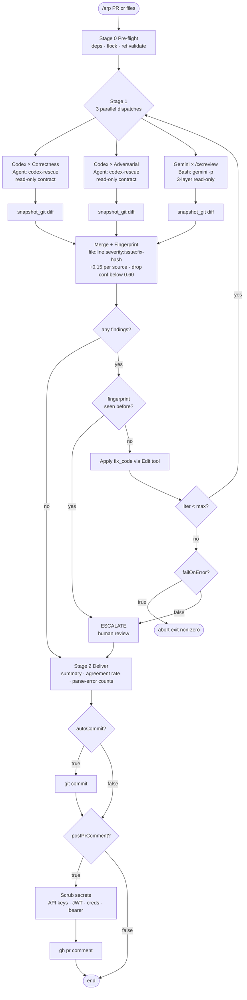

# agent-review-pipeline

Autonomous dual-engine code review pipeline for [Claude Code](https://claude.ai/code). **Asymmetric dispatch** — [Codex](https://github.com/openai/codex-plugin-cc) runs ARP's dual-framing (correctness + adversarial) while [Gemini CLI](https://github.com/google-gemini/gemini-cli) runs its own `/ce:review` compound-engineering pipeline. 3 parallel perspectives per iteration. Dedups findings by confidence, auto-fixes inline, escalates unresolvable findings. Verification delegated to your CI.

## What It Does

1. **Asymmetric Dual-Engine Review** — 3 parallel dispatches per iteration: Codex × correctness, Codex × adversarial, Gemini × `/ce:review`. Codex gets ARP's framing discipline; Gemini uses its own multi-persona compound-engineering pipeline (P0-P3 tiering) because it already has one. No redundancy.
2. **Confidence-Weighted Consensus** — Findings fingerprinted by `file:line:severity:normalize(issue):sha1(fix_code[:200])`. Multi-source agreement boosts confidence by `+0.15` per extra source. Findings below `0.60` confidence are dropped.
3. **Bounded Auto-Fix Loop** — Applies `fix_code` inline, re-runs until PASS or `maxIterations` (1-10, default 3). Unlimited loops are intentionally not supported.
4. **Loop-Thrash Kill Switch** — If a fingerprint reappears after its fix was applied, the fix didn't work. The finding is escalated to human review instead of looping forever.
5. **Safe Defaults** — `autoCommit` and `postPrComment` default to `false`. `--dry-run` previews findings without editing. Dependency precheck fails fast if Codex / Gemini CLI missing.
6. **Agreement Telemetry** — Per-run `.arp_session_log.json` records Codex↔Gemini agreement rate. Tune dual-engine cost/value over time.

## How It Works



**Why asymmetric (the "3 dispatches from 2 engines" question):**

```
Codex                              Gemini
  │                                  │
  ├── correctness framing  (ARP)     │
  ├── adversarial framing (ARP)     ─┴── /ce:review
  │                                       (multi-persona pipeline,
  │                                        P0–P3 tiering, internal)
  ▼                                   ▼
 2 dispatches                     1 dispatch
  └────────── 3 perspectives merged by fingerprint ──────────┘
```

Codex has no built-in multi-persona reviewer, so ARP supplies its dual-framing discipline directly. Gemini already ships `/ce:review` (the compound-engineering pipeline) — running ARP-side dual-framing on top would just duplicate work, so ARP delegates to it.

## How It Differs from Single-Engine Agents

| Single-Engine Agent | ARP |
|---------------------|-----|
| One LLM, single framing | Codex × 2 framings + Gemini × `/ce:review` → 3 parallel perspectives |
| Suggests, leaves fix to human | Auto-fixes inline, bounded loop (cap 10) |
| Loops forever on unfixable bugs | Fingerprint kill switch escalates stuck findings |
| Commits without review | Opt-in commit and PR comment |
| Blind cost | Agreement telemetry for `both` → single-engine tuning |

## Installation

```
/plugin marketplace add onchainyaotoshi/agent-review-pipeline
/plugin install agent-review-pipeline@agent-review-pipeline
/reload-plugins
```

## Usage

Review the current branch, asymmetric 3-dispatch by default:
```
/arp
```

Review a specific PR:
```
/arp 42
```

Preview without editing files:
```
/arp --dry-run
/arp --dry-run 42
```

### Engine Selection

```
/arp both     # Codex dual-framing + Gemini /ce:review (default, 3 dispatches)
/arp codex    # Codex only (2 dispatches — correctness + adversarial)
/arp gemini   # Gemini only (1 dispatch — /ce:review)
```

### Flags

| Flag | Description |
|------|-------------|
| `--dry-run` / `-d` | Print findings + proposed fixes without applying any Edit, commit, or PR comment |
| `--max-iterations N` / `-n N` | Max auto-fix iterations. Clamped to 1-10. Default 3. |

See the [plugin README](plugins/agent-review-pipeline/README.md) for prerequisites, config reference, and tuning notes.

## License

MIT
