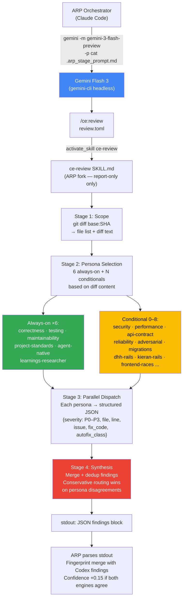

# agent-review-pipeline

Autonomous dual-engine code review pipeline for [Claude Code](https://claude.ai/code). **Asymmetric dispatch** — [Codex](https://github.com/openai/codex-plugin-cc) runs ARP's dual-framing (correctness + adversarial); [Gemini CLI](https://github.com/google-gemini/gemini-cli) runs its own `/ce:review` compound-engineering pipeline. Findings merged by confidence, auto-fixed inline, unresolvable ones escalated. Verification delegated to your CI.

## What It Does

1. **Asymmetric Dual-Engine Review** — 3 parallel dispatches per iteration when `defaultEngine: both`:
   - **Codex × correctness** (ARP framing: logic errors, null derefs, broken callers)
   - **Codex × adversarial** (ARP framing: races, injection, edge cases, auth bypass)
   - **Gemini × /ce:review** (Gemini's compound-engineering multi-persona pipeline with P0-P3 tiering)

   **Why asymmetric:** Gemini already has `/ce:review`. Running ARP-side dual-framing on top of it would duplicate work. Codex has no equivalent, so ARP provides the framing discipline for Codex.

2. **Confidence-Weighted Consensus** — Findings fingerprinted by `file:line:severity:normalize(issue):sha1(fix_code[:200])`. Multi-source agreement boosts confidence by `+0.15` per extra source (cap 1.0). Findings below `0.60` dropped.

3. **Bounded Auto-Fix Loop** — Applies `fix_code` via Edit tool, re-runs until PASS or `maxIterations` (1-10, default 3). Unlimited intentionally unsupported.

4. **Loop-Thrash Kill Switch** — Fingerprint reappears after its fix was applied → the fix didn't work → escalate to human review instead of looping forever.

5. **Safe Defaults** — `autoCommit` and `postPrComment` default to `false`. `--dry-run` previews findings without editing. Dependency precheck fails fast.

6. **Agreement Telemetry** — Per-run `.arp_session_log.json` records Codex↔Gemini agreement rate for cost/value tuning.

## How It Differs from Single-Engine Agents

| Single-Engine Agent | ARP |
|---------------------|-----|
| One LLM, single pass | Codex × 2 framings + Gemini × `/ce:review` — 3 perspectives |
| Suggests, leaves fix to human | Auto-fixes inline, bounded loop (cap 10) |
| Loops forever on unfixable bugs | Fingerprint kill switch escalates |
| Commits without review | Opt-in commit and PR comment |
| Blind cost | Agreement telemetry + dispatch-level attribution |

## Prerequisites

- [Claude Code](https://claude.ai/code) CLI.
- [Codex CLI](https://github.com/openai/codex) installed + authenticated + [Codex plugin](https://github.com/openai/codex-plugin-cc):
  ```
  /plugin marketplace add openai/codex-plugin-cc
  /plugin install codex@openai-codex
  ```
- [Gemini CLI](https://github.com/google-gemini/gemini-cli) installed + authenticated — verify `gemini --version`.
- **`/ce:review` extension** for Gemini — verify `~/.gemini/commands/ce/review.toml` exists. Provides the compound-engineering review pipeline.
- `gh` CLI authenticated if reviewing PRs by number.

Use `/arp codex` or `/arp gemini` to force a single engine if the other isn't available.

## Installation

```
/plugin marketplace add onchainyaotoshi/agent-review-pipeline
/plugin install agent-review-pipeline@agent-review-pipeline
/reload-plugins
```

## Usage

Auto-detect open PR for current branch, 3-dispatch review:
```
/arp
```

Review a specific PR:
```
/arp 42
```

Preview without editing files:
```
/arp --dry-run
/arp --dry-run 42
```

> PR is the sole review target. ARP requires `gh` CLI authenticated. If the current branch has no open PR, push and open one first or pass `<PR number>` explicitly.

### Engine Selection

```
/arp both     # Codex dual-framing + Gemini /ce:review (default, 3 dispatches)
/arp codex    # Codex only (2 dispatches — correctness + adversarial)
/arp gemini   # Gemini only (1 dispatch — /ce:review)
```

### Flags

| Flag | Alias | Description |
|------|-------|-------------|
| `--dry-run` | `-d` | Print findings + proposed fixes, apply nothing |
| `--max-iterations N` | `-n N` | Max auto-fix iterations. Clamped to 1-10. Default 3. |

```
/arp -n 5 42           # up to 5 iterations on PR 42
/arp --dry-run gemini  # preview Gemini's /ce:review findings only
```

### Pre-flight model probe

Before a long `/arp` run, check that your Gemini model has headless server capacity:

```
scripts/probe-gemini.sh                       # probe default model
scripts/probe-gemini.sh gemini-3.1-pro-preview
```

Exit `0` = model is responsive. Exit `2` or `3` = capacity exhausted; pick a different model or retry later. Saves you from burning the 30-minute dispatch timeout on retry storms.

## Configuration (`plugin.json` userConfig)

| Key | Default | Description |
|-----|---------|-------------|
| `maxIterations` | `3` | Auto-fix retry limit. Range 1-10. |
| `failOnError` | `false` | Abort on stage failure instead of escalating |
| `defaultEngine` | `"both"` | `both`, `codex`, `gemini` |
| `geminiModel` | `"gemini-3-flash-preview"` | Passed to `gemini -m`. Default is 3-flash-preview because rc13 e2e proved this Gemini-3 Flash deployment + the fork's sequential persona spawn delivers real findings JSON within the 10-minute headless budget — Pro deployments (`gemini-3.1-pro-preview`, `gemini-2.5-pro`) fail with `MODEL_CAPACITY_EXHAUSTED` 429s. Override to `gemini-3.1-pro-preview` when Pro server-cap recovers and you want max quality. Cascade on 429: `<geminiModel>` → (gated `ALLOW_FLASH_FALLBACK=1`) `gemini-3.1-flash-lite-preview`. |
| `autoCommit` | `false` | Auto-commit fixes. **Off by default** — review first. |
| `postPrComment` | `false` | Auto-post summary via `gh pr comment`. **Off by default**. |
| `dryRun` | `false` | Run review without Edit / commit / PR comment |

## Pipeline

```
   ┌────────────────────────────────────────────┐
   │ 0. Context Setup                           │
   │    Scan rules from PR base ref:            │
   │      AGENTS.md, CLAUDE.md, .cursorrules,   │
   │      CONTRIBUTING.md, .claude/rules/*.md,  │
   │      .claude/CLAUDE.md, docs/CONVENTIONS*  │
   │    Fetch PR conversation context:          │
   │      title, body, comments, reviews,       │
   │      unresolved review threads (GraphQL)   │
   │    Precheck: codex-rescue, gemini CLI,     │
   │    ~/.gemini/commands/ce/review.toml       │
   └──────────────────┬─────────────────────────┘
                      │
   ┌──────────────────▼─────────────────────────┐
   │ 1. Review — 3 parallel dispatches           │
   │    codex   × correctness framing            │
   │    codex   × adversarial framing            │
   │    gemini  × /ce:review                     │
   │    Merge + fingerprint + confidence         │
   │    Kill switch on repeat fingerprint        │
   │    Auto-fix → loop until PASS or max        │
   └──────────────────┬─────────────────────────┘
                      │ PASS
   ┌──────────────────▼─────────────────────────┐
   │ 2. Deliver                                  │
   │    Print summary + agreement rate           │
   │    (Opt-in) git commit                      │
   │    (Opt-in) gh pr comment                   │
   └────────────────────────────────────────────┘
```

### Gemini Engine Internals (`/ce:review`)



**Why not a black box:** `/ce:review` isn't one reviewer — it spawns N personas in parallel, each returning structured JSON. Stage 4 Synthesis merges and resolves conflicts (conservative route wins on disagreement). ARP receives the merged JSON as stdout — no disk writes, no branch switch, `mode:report-only` enforced by the ARP fork.

## Example Output

```
Agent Review Pipeline: PASS  (asymmetric 3-dispatch)

Review (iter 2/3):
  Dispatches: codex:correctness, codex:adversarial, gemini:ce-review
  Findings by severity: critical=1, high=2, medium=1
  By source: codex:correctness=2, codex:adversarial=1, gemini:ce-review=2
  Agreement rate: 0.67 (codex_only=1, gemini_only=1, both=2)
  Fixes applied: 4
  Escalated: 0
  Parse errors: 0

Deliver:
  Summary printed to stdout.
  autoCommit=false → no commit
  postPrComment=false → no PR comment
```

`N/max iter` — N = cycles run, max = configured limit. `ESCALATED` = kill switch triggered.

## Tuning

- **Agreement rate < 0.3** → engines genuinely disagree, dual-engine earning cost.
- **Agreement rate > 0.9** → engines agree often. Consider `defaultEngine: gemini` (cheaper, 1 dispatch) + raise threshold to 0.75.
- **Codex adversarial contribution < 10% of unique findings** → drop to single Codex framing, halve Codex cost.

## License

MIT
